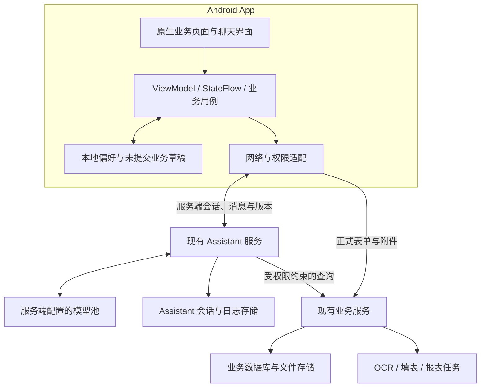

# 移动端需求文档

- 文档版本：v0.7 需求、合同与模块目录
- 更新日期：2026-09-23
- 状态：已纳入本轮完整需求讨论；已确认事项可作为范围依据，技术选型、实现细节和待确认项不等于全部已定稿
- 项目位置：`/home/tdy/projects/mobile/`，独立于 CityBond 项目
- 代码分析基线：CityBond `develop`，提交 `390218ac`（完整提交 `390218ac3a1c13dbd0a3cf42b19603a3d130cf64`）
- 当前阶段：B08 已同步运行时合同和权限目录，B10/B11 已完成最新目录、综合台账骨架和视觉统一，B12 已接入服务端 AI 会话，B13 已完成 App 启动登录门禁、验证码和 Cookie 会话；正式业务读写与完整权限过滤仍待后续批次，详见 [开发进度](开发进度.md)

**文档目的与对话来源**

将本轮对话中的产品要求、用户确认、代码分析发现和技术建议汇总为后续页面设计、接口对接、开发及验收的共同依据。按主题整理，保留关键用户原话，不将助手的建议自动记为用户已确认事项。

| 对话节点 | 原始要求或反馈 | 纳入内容 |
| --- | --- | --- |
| 需求发起 | “读取develop分支下的后端代码，给我一个基于Android app的移动端方案，包括架构，技术栈，实现现有的所有功能，并实现用户多轮对话，对话不上传到云端，先不要写代码，有问题向我提问” | Android 平台、develop 基线、全功能、多轮对话、对话隐私、先设计不写代码 |
| 边界澄清 | 对“是否允许对话发送自有后端/内网模型服务器”“是否允许业务表单和附件上传现有后端并使用 OCR”“是否要求离线办理”的回答：“第一第二允许，不要求断网办理业务” | 允许自有服务器处理对话、允许上传业务数据和附件、无需离线正式办理 |
| 深化分析 | “分析业务重难点具体采用那些技术栈去解决这些问题，做到展示所有业务功能” | 业务难点到技术方案的映射、完整入口与字段/操作覆盖、验收矩阵 |
| 文档归档 | “将上面对话添加到移动端的需求文档里” | 更新本文件并关联详细设计与接口清单 |
| 基线更新 | “根据最新的develop分支后端代码更新移动端的需求文档” | 拉取最新远端 develop，以 `a7da695f` 更新接口合同、业务规则、权限、隐私差距和验收要求；不改移动端实现代码 |
| 前端重建 | “将已有的前端代码项目总览模块，ai分析模块等模块删除，以最新的develop分支的后端代码为标准设计” | 删除项目、债务、日历统计和 AI 文档 Mock UI、展示模型、深层路由及对应测试；保留基础壳并建立后端合同驱动的 R01—R08 重建设计 |
| 合同与模块同步 | “根据最新的develop分支下的后端代码更新mobile的相关需求文档和业务模块” | 从固定提交实际构造 FastAPI OpenAPI，更新完整接口及静态路由附录；按权限目录 v3 同步 16 个菜单模块和 33 个权限功能组，但不把合同目录标成业务已实现 |
| AI 助手入口 | “AI对话功能，我打算做成AI对话智能助手，放在助手里……也可以通过浮动小球……随时对话” | 助手一级页提供完整对话；其他页面提供全局悬浮入口和快捷对话面板 |
| 对话存储决策 | “直接复用接口，顺便将需求文档的相关需求更新” | 复用现有 Cookie 登录和 Assistant 会话接口；接受对话、上下文及模型追踪按现有服务端策略持久化，不再要求仅手机本地加密保存 |
| 登录入口调整 | “登录功能不要放在助手这一导航里，直接在用户打开 app 时，就让他完成登录” | 启动 App 先检查 Cookie 会话；未登录只展示全局登录页，登录成功后才进入首页；助手页不再承载登录或退出 |

既有 v0.1 中“此前讨论不可见、整体待补充”的说明已由本轮实际讨论替代。不推测仍未提供的更早历史内容。

**已确认的产品需求**

| 编号 | 需求 | 状态 |
| --- | --- | --- |
| APP-001 | 目标平台为 Android，移动项目独立放在 `/home/tdy/projects/mobile/` | 已确认 |
| APP-002 | 以 develop 分支现有业务为迁移依据，提供架构与技术栈方案 | 已确认 |
| APP-003 | 移除既有 Mock 业务前端，后续页面只按最新 develop 的运行时 OpenAPI、Schema、权限与服务端状态机设计和实现 | 已确认 |
| AUTH-001 | App 启动时先调用 `/auth/me` 检查会话；无有效会话时必须完成全局登录后才能访问首页、业务、助手、任务和我的 | 已确认 |
| BUS-001 | 实现并展示所有已实现的业务功能，包括复杂页面内部操作和适用的系统管理能力 | 已确认 |
| AI-001 | 提供用户多轮对话，能连续补充、纠正信息并继续办理业务 | 多轮对话已确认，具体交互为下述方案细化 |
| AI-002 | 助手一级页只承载直接对话，任意业务页面可通过悬浮入口唤醒快捷助手；登录由 App 启动门禁统一处理；复用现有服务端会话、消息和日志策略 | 已确认 |
| DATA-001 | 对话不上传第三方云端；允许发到自有后端/内网模型服务处理 | 原始要求及后续澄清 |
| DATA-002 | 允许正式业务表单、合同、发票、照片等附件上传现有后端，允许服务器 OCR | 已确认 |
| NET-001 | 不要求断网时正式办理业务 | 已确认 |
| DOC-001 | 前期仅分析和整理文档；本轮已明确授权同步需求文档和移动端业务模块目录 | 历史边界已更新 |

“功能完整”按各角色授权范围判断，不要求把管理或其他用户数据开放给无权限账号。现有权限、业务规则和操作边界必须保持。

**对话数据与业务数据的边界**

以下是根据澄清形成的当前方案约定，除表中明确写出的用户确认外，属于设计细化，尚未获得逐条独立确认。

| 数据/处理 | 当前方案 |
| --- | --- |
| 对话处理位置 | CityBond 服务器通过现有 Assistant 服务处理；实际模型服务边界以服务端模型池配置为准 |
| 聊天正文、历史、摘要 | 复用现有服务端会话、Turn、Agent 消息及相关日志策略；App 入口明确告知会保存到服务器 |
| 草稿及续办状态 | Assistant 产生的上下文与续办状态随服务端会话保存；未提交的手工业务草稿可按需保存在手机，正式使用时重新做权限和业务校验 |
| 正式业务表单与附件 | 用户确认后按现有业务流程保存在后端；用户已明确允许上传 |
| 正式提交回执、幂等记录和审计 | 后端保存完成业务和防重复所需记录；对话上下文仍按 Assistant 自身存储策略管理 |
| 日志、模型调试及追踪 | 沿用现有服务端策略并纳入访问控制、保留期限和生产脱敏审计；App 不在客户端日志记录 Cookie、密码或完整消息正文 |
| 手机云备份 | App 不维护第二份聊天正文；敏感临时文件和未提交草稿按数据等级决定是否排除自动云备份 |
| 断网行为 | 当前进程中已展示内容可暂时保留，可继续编辑本地业务草稿；恢复会话、AI 回复、最新业务查询及正式提交需要联网 |

服务端会话是聊天历史的唯一事实来源；同一账号在权限允许时可从服务器恢复历史。历史保留期限、用户可见的删除能力、模型服务数据边界和管理员访问审计需要在上线前与服务端策略一起确认。

**代码分析结论与限制**

| 发现 | 需求/设计影响 |
| --- | --- |
| 后端基于 FastAPI、SQLAlchemy，使用 PostgreSQL 驱动，具备现有业务服务和后台 Worker | 复用后端接口、计算和事务；手机负责页面、交互与本地状态 |
| 登录采用 Cookie 会话，已有验证码、续期、角色权限与数据范围控制 | Android 需要适配实际登录合同，不能默认已有 JWT/刷新 Token 机制 |
| Assistant 已有多轮对话、候选卡片、草稿、父子续办和表单回执 | 直接复用现有会话和持久化能力；移动端适配会话版本、卡片协议、权限和错误语义 |
| `/sync/changes` 返回变更对象和缓存失效信息 | 用于更新缓存；不是双向离线同步，也不是实时推送 |
| Web 前端存在计划生成、保证金抵扣和利率反算等 TypeScript 算法 | 迁移需同时核对 Web 行为；缺失的公共计算能力优先补到后端 |
| OCR、填表、整理、导出等任务的持久化及取消/重试能力不同 | 统一展示，但只开放实际支持的任务操作 |
| “成本测算”“AI报告生成（定制）”是占位菜单 | 保留升级中状态；已有综合成本、IRR、组合报表能力仍完整纳入 |
| HTTP 权限改为路由默认权限、端点覆盖和启动期全量校验；Assistant 工作流携带业务权限码 | App 必须以 `/auth/me` 返回的角色、权限和权限版本驱动入口及动作；Assistant 可见不代表其所有业务工具均可执行，仍需满足项目、债务、单据等目标业务权限 |
| 项目响应增加实际速记到账额和已关联正式融资合计；删除正式债务会联动软删除关联实际速记及其来源计划 | 项目台账要展示并解释两类金额；删除确认和刷新范围要覆盖债务、实际速记、来源计划及项目汇总，不能保留可继续操作的孤儿记录 |
| 不动产新增评估价值、正式债务抵押明细、抵押状态和可用抵押额度；项目拟抵押与正式抵押使用统一容量算法 | App 只能展示后端口径的可用额度，编辑债务时携带排除的债务 ID，并把剩余担保余额作为只读值；提交仍以后端并发校验为准 |
| 还本付息单新增待打印编辑及版本控制；成本审批单新增打印登记、打印元数据和打印状态筛选 | 移动端补齐单据编辑、影响确认、冲突刷新、打印前校验、打印记录和按打印状态统计，不能把“下载文件”直接等同于已记录打印 |
| 周期付息生成明细会作为快照持久化；附属费用收款账户可能自动收录到服务机构账号清单 | App 保存并回显服务器计划快照，周期方式不得误启用自定义金额；债务保存后按账号同步状态给出准确反馈 |
| Assistant 的债务单位/债权单位草稿字段和债务速记明细扩展，业务分类器增加评估工具；自动填表轮询被拆分为独立生命周期组件 | 移动端卡片和表单协议需兼容别名、启停状态、相似候选确认、实收金额、扣款和保证金明细；评估工具与内部轮询重构不作为普通用户新入口 |

本次直接从远端提交对象构造 FastAPI 应用并读取 OpenAPI，未进入 lifespan、未连接数据库、未切换或覆盖后端工作区的未提交修改，也未验证生产环境。基线实际生成 418 个路径、509 个 HTTP 操作和 850 个 Schema；生产应用源码中另有 45 个文件、510 条 HTTP 路由装饰器声明，其中 1 条未进入 OpenAPI。两个接口清单已同步到 `a7da695f`，数量不是已完成的移动端功能数，正式联调仍需在目标环境核对部署配置、数据库状态和对象数据权限。

**最新 develop 增量需求**

以下 DEV-001—DEV-011 是从 `56437f74..a7da695f` 后端代码、迁移和测试推导出的移动端合同，属于本次方案更新，不表示移动端已经实现。

| 编号 | 后端变化 | 移动端需求与验收口径 |
| --- | --- | --- |
| DEV-001 | HTTP 权限元数据改为缺失即启动失败；未知角色不再回退为普通用户；每个 Assistant 业务定义有独立 `permission_code` | 登录后保存权限快照和 `permission_version`，账号切换、重新登录或版本变化时清空旧菜单/动作缓存；401 回登录，403 保留上下文并提示无权限；业务助手入口和确认动作同时检查 `assistant.view` 与目标业务权限，不按角色名称猜权限 |
| DEV-002 | 项目响应新增 `actual_memo_received_amount`、`actual_memo_linked_financing_total` | 项目列表/详情分别显示实际到账、已关联正式融资及差额，标明金额单位与缺失值；速记关联、债务保存/删除后刷新项目及速记数据 |
| DEV-003 | 删除正式债务会在同一事务中软删除其关联实际速记；若该实际速记由计划转换且关系仍匹配，同时软删除来源计划 | 删除确认明确联动对象；成功后从债务、计划速记、实际速记和项目汇总移除；事务失败不得出现部分删除，历史遗留孤儿由服务端启动清理，不由 App 本地猜测修复 |
| DEV-004 | 债务速记 Assistant 增加 `actual_received_amount`、最多 200 条 `deductions` 和 `deposits`；明细含类型、金额、日期、备注、是否从放款扣除、排序号 | 手工表单和聊天草稿使用同一明细模型，支持逐条增删改、排序及清空；非负金额、日期、上限和计划/实际类型约束以后端错误为准；摘要要区分放款金额、实际到账、扣款和保证金 |
| DEV-005 | 不动产以正数评估价值优先、否则回退账面价值；存量抵押全额占用，同一项目拟抵押与正式抵押取较大值，不同项目分别占用；选项接口增加 `project_id`、`exclude_debt_id` | 不动产页录入/展示评估价值、抵押状态、正式债务抵押清单和可用抵押额度；项目及债务选择器显示服务端额度。编辑债务用 `exclude_debt_id` 加回本记录原额度，剩余担保余额只读；无价值基数时显示“无法计算”而不是 0，超额和并发变化以服务端拒绝为准 |
| DEV-006 | 非自定义的周期付息方式也持久化 `custom_interest_due_items` 作为已确认快照，但 `use_custom_interest_plan_amounts=false`；快照最后一期必须落在到期日 | 生成预览确认后提交完整日期快照并原样回显；周期规则仍负责计息，不能把快照金额当作自定义计息金额；修改借款日、到期日或方式后重新预览并校验末期日期 |
| DEV-007 | 创建/更新债务响应增加 `supplementary_fee_account_sync`：`created`、`reused`、`updated` 或 `incomplete` | 附属费用保存成功与账号收录结果分开反馈；`incomplete` 不得显示“账号已收录”，允许用户去财务协同补齐；重复账号、共享账号冲突和后续失败均以后端事务结果为准，App 不自动重放写请求 |
| DEV-008 | 新增 `PUT /api/v1/documents/repayment-payments/{document_id}`；列表支持 `document_status=all`，项目增加 `version_no`、`can_edit` | 仅有效、`pending_print`、未打印且关联现金流未支付的单据显示编辑；提交全部快照字段和 `version_no`。日期或金额变化须二次确认 `impact_acknowledged`；处理重复单据和 409 版本冲突；提前还款编辑成功后展示服务端未来本息重算结果，不做客户端替代计算 |
| DEV-009 | 成本审批列表的 `status` 支持 `all`、`printed`、`unprinted`、`voided`，计数支持同一关键字；新增 `POST /api/v1/documents/cost-approvals/{document_id}/print`，返回打印次数、最近打印时间及人员 | 在项目台账内提供成本审批列表/详情入口和全部、已打印、未打印、已作废筛选；关键字与计数口径一致。仅有效、内容完整且关键要素齐全的单据可登记打印；文件成功交给打印流程后再调用登记接口，重打使用 `source=reprint`，取消或失败不得增加次数 |
| DEV-010 | Assistant 债务单位/债权单位新增草稿支持别名和启停；债务单位默认不设置上级、备注上限 500；债权单位支持相似候选的选择或明确“仍新建” | 移动端复用完整基础资料字段，候选过期时重新查询，用户未明确选择时不得合并；确认前再次展示上级、别名、启停状态和相似记录；每次提交携带会话版本，提交中禁止重复点击 |
| DEV-011 | `develop` 环境的 LLM 客户端会记录原始请求、响应和工具调用到终端及 `logs/llm_terminal_trace.log`，单文件 10 MiB、最多 5 个历史文件 | 此能力只视为后端调试实现，不纳入移动端用户功能。它与 DATA-001/AC-06 冲突；移动端正式联调门禁为：移动入口请求级禁用或脱敏原文、验证终端与全部滚动文件无正文/摘要/业务敏感值，并明确开发日志清理和访问权限 |

**移动端业务模块目录（权限目录 v3）**

后端权限目录把 33 个权限功能组放入 16 个菜单模块。移动端 B08 已同步这些稳定键、展示分组、功能名和 `<group>.view` 可见条件；当前页面仅展示合同覆盖状态，不提供点击后的业务页面，也不绕过尚未完成的登录权限判断。

| 分区 | 菜单键 | 移动端模块 | 权限功能组 | 当前移动端状态 |
| --- | --- | --- | --- | --- |
| 项目与融资 | `financing-overview` | 融资总览 | `overview`、`announcements` | 合同已同步，待 R01—R03 |
| 项目与融资 | `project-ledger` | 项目台账 | `project` | 合同已同步，待 R03/R05 |
| 项目与融资 | `debts` | 融资明细 | `debt`、`pending_debt` | 合同已同步，待 R04/R05 |
| 项目与融资 | `debt-memo` | 资金速记 | `memo` | 合同已同步，待 R06 |
| 项目与融资 | `dataentry` | 跨部门协同 | `finance`、`engineering`、`asset` | 合同已同步，待 R06 |
| 技能 / Skill | `ocr-upload` | AI 录入 | `ocr` | 合同已同步，待 R07 |
| 技能 / Skill | `ocr-sheet-fill` | 自动填表 | `sheet_fill`、`debt_init` | 合同已同步，待 R07 |
| 技能 / Skill | `cost-estimation` | 成本测算 | `cost_estimation` | 后端升级中占位 |
| 技能 / Skill | `query` | 综合查询 | `query` | 合同已同步，待 R07 |
| 技能 / Skill | `documents` | 业务审批 | `documents` | 合同已同步，待 R06 |
| 技能 / Skill | `valueadded` | 基础材料 AI 打包 | `materials` | 合同已同步，待 R07 |
| 技能 / Skill | `ai-report-generation` | AI 报告生成（定制） | `ai_report_generation` | 后端升级中占位 |
| 管理员功能 | `master-data` | 债务信息维护 | `master_data` | 合同已同步，待 R07 |
| 管理员功能 | `system` | 系统配置 | `ocr_settings`、`ai_settings`、`backup`、`extraction`、`sheet_rules`、`parameters`、`users`、`permissions`、`holidays`、`lpr`、`audit`、`development` | 合同已同步，待 R07 |
| 管理员功能 | `guarantee` | 对外担保和授信统计 | `guarantee`、`credit` | 合同已同步，待 R07 |
| 其他设置 | `assistant` | AI 对话 | `assistant` | 基础会话已接入；业务工具与卡片待 R08 |

可见性规则只检查后端返回的显式权限集合：任一子功能的 `<group>.view` 存在时可显示该菜单，具体动作继续检查自己的权限码及数据范围；仅有 `edit`、`create` 或角色名称不能推导可见。B08 单元测试固定 16 个菜单键、33 个权限组、基线提交和权限目录版本，以便后端目录变化时显式失败。

**建议架构与职责**

建议采用“Android 原生 App + 现有业务后端 + 自有服务器 AI 推理”。主体业务页面使用 Kotlin/Compose，复杂图表和文档预览使用受控嵌入组件。技术栈尚为建议，不代表每项依赖已经选定版本或完成兼容验证。

App 负责功能导航、完整字段展示、输入校验、未提交业务草稿，以及服务端聊天会话的展示与恢复。后端负责 Assistant 上下文、对象权限、权威财务计算、业务约束、正式写入、事务、回执和审计。AI 负责理解、追问和受约束的工具请求，不能替代后端授权或业务校验。

不要求离线正式办理，因此暂不建设完整的双向离线同步，不在手机部署模型或后端数据库服务。不因 Android 接入而默认更换数据库、拆微服务或引入新的消息队列。

**技术栈建议及用途**

| 层 | 具体技术 | 解决的问题 |
| --- | --- | --- |
| Android 工程 | Kotlin、Gradle Kotlin DSL、版本目录、按业务拆分模块 | 各业务可以独立开发和验收；共用网络、权限、表单、表格和任务组件 |
| 页面与导航 | Jetpack Compose、Material 3、Navigation Compose、自适应单双栏布局 | 手机分组表单、横屏表格、平板主从详情、业务深层跳转 |
| 状态与依赖 | ViewModel、Coroutines、StateFlow、Hilt | 单向状态流、异步取消、搜索防抖、切页恢复、可测试用例 |
| 台账 | LazyColumn、Paging 3、共享横向滚动、服务端分页筛选 | 大量记录、宽表、多条件筛选、列设置、选择及批量操作 |
| 金额与日期 | BigDecimal、受控序列化、LocalDate/Instant | 金额小数精度、元/万元/亿元换算、日期与时区区分 |
| 网络 | Retrofit、OkHttp、CookieJar、流式文件传输 | 复用现有 Cookie 登录、分环境服务地址、请求超时和错误分类 |
| 本地数据 | DataStore；需要离线草稿时再引入 Room | 普通偏好、账号隔离和未提交业务草稿；AI 对话历史由现有服务端会话接口保存 |
| 图表 | Compose 指标卡 + 本地打包 Apache ECharts、AndroidX WebKit | 趋势、结构、堆叠、联动与钻取；JS/CSS 不从外部 CDN 加载 |
| 拍照与预览 | CameraX、系统文件选择器、Coil、Compose Canvas、PdfRenderer | 图片、合同多页预览、原文框选、缩放及 OCR 坐标高亮 |
| 报表/表格预览 | 本地 HTML/CSS 渲染器 + WebViewAssetLoader | 合并表头、合并单元格、分页报告；输入为受控结构化数据 |
| 任务 | 前台协程轮询、WorkManager、服务端现有任务 Worker | 实时前台进度与可延迟后台恢复分别处理；进程退出不重复创建服务器任务 |
| 正式业务 | FastAPI、Pydantic、SQLAlchemy、现有数据库与审计 | 对象权限、业务校验、计算、事务、幂等和版本冲突 |
| AI | 服务端配置的模型池、现有 LangChain Agent、明确需要状态编排的 LangGraph | 多轮推理、服务端会话持久化与工具调用；复用现有业务工具和版本合同 |
| 文件生成 | 现有 openpyxl、python-docx 等渲染；必要时增加自有 PDF 转换服务 | 保留原格式下载；补齐 App 内预览和打印 |
| 验证 | pytest、JUnit、MockWebServer、Compose UI Test、真机 Macrobenchmark | 财务规则对照、接口变化、权限、复杂页面性能与完整流程验证 |

底层组件的官方资料、选型依据与实现限制详见[业务重难点与全功能展示方案](Android业务重难点与全功能展示方案.md)。具体 Android/Gradle/JDK/依赖版本在建立工程前按兼容矩阵确定。

**业务重难点及解决要求**

| 编号 | 难点 | 具体解决方案与验收关注点 |
| --- | --- | --- |
| DIF-01 | 多融资品种、字段联动、重复明细与机构树 | Compose 分组表单、强类型 Draft、稳定明细 ID、远程树形搜索；类型切换检查受影响字段；AI 与手工操作共用草稿 |
| DIF-02 | 金额、利率、日期、LPR、保证金抵扣、抵押额度、IRR 一致性 | BigDecimal/LocalDate，后端 Decimal 计算服务；逐项核对 Web 算法，补公共计算接口；同输入下预览、快照、保存及导出一致；不动产评估价值优先与同项目取较大占用规则由后端统一计算 |
| DIF-03 | 窄屏展示宽台账和所有字段 | 卡片/完整表格/完整详情；LazyColumn、服务端分页、共享横向滚动、冻结列、列设置、保存视图、横屏及关联钻取 |
| DIF-04 | 大数据量、分页与跨页选择 | Paging 3 或页码分页按场景选用；服务端排序筛选、全量合计和导出；不能只对当前页操作并误称全量 |
| DIF-05 | 多轮对话、业务切换及父子续办 | 复用服务端 Conversation、消息和 `version_no`；每会话串行请求，409 后重新加载；业务 Draft 和父子任务继续按服务端状态机处理 |
| DIF-06 | 对话持久化与可见告知 | 复用现有 Assistant 对话表、Turn、Agent 消息及 LLM 日志；App 明确提示对话会保存到服务器，不把服务端会话误称为本地私密会话；生产环境按既有日志访问与保留制度管理 |
| DIF-07 | OCR 原文定位与人工复核 | CameraX、Coil、Compose Canvas、后端页图/证据；缩放后坐标正确，无证据不伪造高亮；修订后进入正式表单校验 |
| DIF-08 | 自动填表、合并表头、字段映射与结果确认 | 原生映射/规则面板 + WebViewAssetLoader 加载受控预览；转义外部内容，不执行文件/模型脚本；公式计算留在服务器 |
| DIF-09 | 长任务、大文件与进程退出 | 流式传输、前台协程轮询、适用的 WorkManager/传输机制、服务端 Worker；保存任务 ID 后恢复查询，按真实能力取消/重试 |
| DIF-10 | 重复提交、超时、双端并发修改 | client_request_id、预期版本、唯一约束、事务和最小回执；还本付息单等版本化更新遇 409 时刷新并人工合并；参数不一致的重复键拒绝；主记录与附件失败分别恢复 |
| DIF-11 | 角色、数据范围与系统管理 | CookieJar、统一权限状态；菜单/按钮/对象/AI 工作流/下载同一授权边界；未知角色无默认权限，401/403、验证码、停用、权限版本变化及真实交互续期均覆盖 |
| DIF-12 | 图表、报表、合计和口径可核对 | Compose 指标卡 + 本地 ECharts，服务器聚合；显示主体、日期、单位、条件和依据；图表可打开数表及明细 |
| DIF-13 | 手机打印与 Office 导出 | 复用 Excel/Word 导出；补齐 PDF 预览及 PrintDocumentAdapter；必要时自有 Office 转换 Worker，验证中文字体、分页和金额 |

特别约束：Room 本身不自动加密；WorkManager 不能保证秒级刷新；已有分片备份上传不代表普通附件已支持断点续传；现有 Assistant 幂等也不代表所有正式业务接口已具备幂等。

**全功能展示与移动端页面范围**

建议底部入口：首页、业务、助手、任务、我的。业务页提供全部功能目录、分组、功能名称搜索和收藏；系统管理在“我的”下，同时可被授权用户通过全部功能目录发现。

每项业务要提供完整详情和适用操作。列表卡片不能代替完整字段，导入导出、状态变更、历史、恢复、预览、关联等不能因移动屏幕小而遗漏。

以下 F01—F40 从代码分析和前轮方案整理，作为覆盖核对分组。权限目录中的文字不自动证明存在可运行接口；实际功能要结合前端行为、业务服务、OpenAPI 和联调逐项验证。

| 编号 | 一级入口 / 功能组 | 完整展示内容与操作 |
| --- | --- | --- |
| F01 | 首页 / 融资总览 | 主体口径、到账、余额、缺口、融资渠道和成本变化、项目进度、每日到账、还款月份钻取；总览配置 |
| F02 | 首页 / 公告与待办 | 公告列表及详情、待办分类与跳转、系统提示、还款日历、单日详情、现金流和项目汇总 |
| F03 | 业务 / 项目台账 | 项目—融资—债务关联展示；计划速记、实际速记、实际到账、已关联正式融资及差额汇总；列表、筛选、完整详情、创建、修改、导入模板/导入结果、导出、债权方关联、历史 |
| F04 | 项目详情 / 项目进程 | 接洽记录、复核日期/事项等现有操作、再融资关系、阶段调整、融资完成、放弃及恢复、删除及恢复 |
| F05 | 业务 / 融资明细 | 全部、未结清、已结清；主债务、附属债务/费用；创建、修改、删除、历史、合同附件；删除时展示并处理关联实际速记和来源计划的联动软删除 |
| F06 | 融资明细 / 待补充债务 | 列表与筛选、补充编辑、删除、转正式、转换后的业务跳转 |
| F07 | 债务表单 / 品种与关联 | 普通及品种专用字段、共同债务人、多债权人、自动关联项目、票据、债券、存单/保证金及适用的融资字段 |
| F08 | 债务表单 / 担保措施 | 保证人、不动产抵押、股权质押、应收账款、收费权、存单/保证金、其他担保及无担保；明细增删改；不动产可用抵押额度展示、超额校验和只读剩余担保余额 |
| F09 | 债务表单 / 本息与费用 | 还款主体与账号、本金/利息计划生成和转换、周期计划快照、导入导出、固定/浮动利率、LPR 重定价、利率反算、保证金抵扣、费用明细及附属费用账号收录结果 |
| F10 | 融资明细 / 计算与统计 | 任意日期本金余额、未偿余额、放款和资金统计、综合成本、利息和票据预览、IRR 与计算过程/公式导出（依权限） |
| F11 | 业务 / 还款现金流 | 即将到期、按日/月查看、债权方拆分、已付/未付及适用跳过操作、历史处理/重算及关联单据 |
| F12 | 业务 / 资金速记 | 计划/实际列表、增删改、高级筛选、计划转实际、关联债务和预填；放款金额、实际到账额、扣款与保证金明细（类型、金额、日期、备注、是否从放款扣除、排序）；看板、资金缺口、排行、动态 |
| F13 | 业务 / 财务协同 | 银行账号、联行号解析及账号信息，承接附属费用收款账号自动新增/复用/补齐状态；发票列表/详情/增删改、发票行、关联单位和项目、原有核对与关联操作 |
| F14 | 业务 / 工程协同 | 工程项目创建、修改、状态变更、删除、完整详情与项目关联 |
| F15 | 业务 / 资产协同 | 不动产、实控公司、企业集团；增删改、状态、附件/基础材料、集团口径与项目关联；不动产评估价值、正式债务抵押明细、抵押状态、价值占用及可用抵押额度 |
| F16 | 业务 / 还本付息单 | 创建/查询、通知单解析、重复检查、有效/作废列表（支持全部）和原有付款/流程分类计数、自动生成状态/执行、回单核验；未打印待打印单据的版本化编辑、影响确认和提前还款重算；办理、打印导出、作废及适用删除 |
| F17 | 业务 / 费用申请单 | 从债务生成、列表/统计、详情、修改、作废、导出 |
| F18 | 项目台账 / 成本审批单 | 项目选择、默认值、创建/修改、重新生成、版本与历史详情；全部/已打印/未打印/已作废筛选和关键字同步计数；打印前完整性校验、打印登记/重打记录、作废/删除、导出 |
| F19 | 业务 / 对外担保 | 导航、台账增删改、余额/状态调整、OCR 预填、附件、统计/明细统计、已有导入导出路径 |
| F20 | 业务 / 授信统计 | 授信统计、手工授信录入维护、模板与导入、银行/上级机构映射、删除、导出 |
| F21 | 业务 / AI 录入 | 拍照/文件上传、识别与复核、页图高亮、字段/发票行修改、分析历史、源文件、替换、删除、模型调试与性能（依权限） |
| F22 | AI 录入 / 文件与归档 | 模块树创建和维护、文档移动/归类、自动整理、合同摘要和债务候选、合同归档、全自动任务及结果处理 |
| F23 | 业务 / 基础材料 | 实控公司/不动产等预填、基础材料录入任务、关联/解绑、三年一期、候选材料、材料清单分析、文件打包 |
| F24 | 业务 / 自动填表 | 模板上传、工作表预览、字段映射查看/分析/确认、结果预览/确认、重试/重跑、任务历史、下载结果、调试数据（依权限） |
| F25 | 自动填表 / 数据初始化 | 模板下载、导入预览与保存、批次与源文件、记录编辑/清理、单条/批量转入待补充债务、转入任务 |
| F26 | 业务 / 综合查询 | 自然语言、快捷模板、高级筛选；项目情况、融资结构/总量/试算、债务结构/月报、集团口径/概览、借新还旧、担保月末、授信、放款及相关明细 |
| F27 | 综合查询 / 报表 | 组合报表、融资工作报表、现有智能分析任务、结果/条件/说明、预览及 Word/Excel 导出；PDF 打印为补齐项 |
| F28 | 助手 | 服务端会话列表、连续聊天、新建/读取/删除历史、业务追问、候选卡片、草稿修改、跳转表单、父子续办、取消与回执；助手一级页和全局悬浮快捷面板共用登录会话；每个工作流按目标业务权限独立授权 |
| F29 | 业务 / 基础资料 | 债务单位树、债权机构、种子配置、担保公司、标准/自定义融资产品、融资品种、不动产等既有资料维护；债务/债权单位别名、启停、上级与相似候选确认可由助手补充但须人工复核 |
| F30 | 任务 | OCR、整理、材料录入、初始化转入、填表、报表分析、导出、上传/下载；按权限汇入备份恢复状态；只展示各任务支持的操作 |
| F31 | 启动登录 / 我的 | 启动会话检查、登录、验证码、当前用户、改密、会话失效、退出、业务草稿管理、显示及服务连接设置；登录成功前不展示主导航 |
| F32 | 系统 / 用户与权限 | 用户增改删、启停、密码重置、管理员交接、角色权限查询与允许的配置、权限依赖说明；只接受正式角色，未知/缺失角色无默认权限，权限目录或版本变化后立即刷新功能入口 |
| F33 | 系统 / 参数与公告 | 参数列表和编辑、公告草稿/编辑/发布/撤回/删除；公告与其他系统页的权限分别判断 |
| F34 | 系统 / LPR 与节假日 | 列表、维护、删除、官方导入；节假日发布及现金流刷新结果按现有接口展示 |
| F35 | 系统 / AI 与 OCR 配置 | AI 服务池新增/编辑/删除/测试、状态/统计、OCR 流程与文档类别、提取目录配置及导入 |
| F36 | 系统 / 填表字段和规则 | 字段查询编辑/导入导出、组织关系、规则新增、版本管理、验证、预览、发布、导入导出 |
| F37 | 系统 / 备份恢复 | 列表、计划、存储位置、手工备份/取消/删除/下载、恢复上传/分片、预检、启动/取消、进度、维护状态和允许的维护释放 |
| F38 | 系统 / 审计与开发 | 审计筛选及详情；开发测试数据查看/导入/清理仅在现有环境与权限允许时展示 |
| F39 | 全局 / 表格与历史 | 字段顺序、宽度、显隐、筛选、排序、保存视图、分页偏好、选择/批量操作；对象历史与版本对照按业务支持情况提供 |
| F40 | 全部功能 / 现有占位 | 成本测算、AI 报告生成（定制）显示“升级中”；不与 F10 的已有计算、F27 的已有报表混同 |

所有功能应有可点击的原生入口。现有 Agent 工作流范围包括项目、债务、资金速记、基础资料、银行账号、发票、不动产、实控公司、工程项目、对外担保、还本付息单等已注册操作，以及查询和合同辅助链路。完整页面覆盖不等于所有操作已经支持自然语言执行；每个工作流必须使用后端返回的独立业务权限，未注册或未授权的 AI 操作只提供准确导航或明确拒绝，新增工具需另行验收。

**多轮对话主流程**

1. 用户进入或新建服务端会话，App 读取会话列表和详情，恢复消息、摘要、当前草稿与待补充信息。
2. 用户发送消息，App 将本轮消息和当前 `version_no` 发给 Assistant 服务。
3. 服务器恢复并推进 Agent 状态，重新校验业务查询权限，持久化本轮结果，返回回复、候选、草稿变化或页面动作及新版本。
4. 信息不足时继续追问；对象不唯一时选择候选；缺失基础资料可启动子任务后回到原草稿。
5. App 用同一份草稿展示表单并接受手工修改，提交前执行适用确认。
6. 后端校验正式请求并在事务中完成业务写入、最小回执和审计；App 根据回执结束当前业务，会话继续存在。
7. 网络异常或 409 版本冲突时重新读取服务端会话；正式业务提交先查询回执，避免重复创建，聊天重试与业务重试分开处理。

既有 render_card、open_form、navigate、run_query 语义可作为移动协议参考。需要版本化，未知动作不能随意执行。会话删除、历史编辑、重生成等涉及旧卡片和草稿失效规则，按详细设计实现，不只删除界面文字。

**后端对接与改造范围**

| 项目 | 要求 |
| --- | --- |
| 登录和授权 | App 根入口复用 Cookie 会话、验证码、`/auth/me` 和续期；登录成功前不构建主导航；使用权限列表及 `permission_version`，未知角色不授予默认权限；业务路由和 Assistant 工作流均以后端显式权限为准；后台轮询不伪造用户活跃 |
| Assistant 对话 | 直接复用 `/assistant/conversations`、`/{id}`、`/{id}/messages` 和现有持久化/日志策略；移动端提交 `version_no`，处理 401/403/409/422/502，不另建无持久化入口 |
| 财务计算覆盖 | 对照现有后端和 Web，补齐需要共享的计划生成、转换、反算等缺口；复用周期计划快照与不动产抵押容量算法，不在 App 复制另一套财务口径 |
| 写入可靠性 | 逐接口核对幂等、对象版本及冲突响应，尤其覆盖还本付息单 `version_no`、影响确认、重复检查和债务删除联动速记事务；禁止盲目自动重试所有 POST/PUT |
| 数据刷新 | 按 /sync/changes 的变更范围失效缓存并重新拉取，处理 has_more、invalidate_all、reset_required |
| 文件与任务 | 复用既有接口；统一 App 展示模型但保留真实能力差异；维护模式暂停写操作 |
| 预览与打印 | 核对结构化表格和 OCR 证据接口，补齐 PDF 预览/下载/打印所需能力；成本审批打印成功后单独登记打印来源，打印取消或失败不得记次 |
| 合同版本 | 登录、验证码、`/auth/me`、退出及 Assistant 基础 DTO 已实现并有固定响应测试；R01 仍需补齐全局权限快照消费、权限版本变化和统一错误模型，其余业务 DTO 继续按批次生成并建立协议变化检查 |

**验收要求**

| 编号 | 维度 | 完成条件 |
| --- | --- | --- |
| AC-01 | 全功能可发现 | F01—F40 每组均有状态；已实现能力在授权范围内可从菜单或对象详情到达，两个占位明确标识 |
| AC-02 | 完整展示与操作 | 完整字段、关联、附件、历史及各自适用增改删、状态、导入导出、预览和恢复操作均有入口 |
| AC-03 | 全业务生命周期 | 创建、编辑、关联、办理、查询、历史和导出按实际状态走通，不能以单个列表可见判定完成 |
| AC-04 | 财务一致性 | Web/App/后端/导出按同一规则一致；月末、闰年、LPR 调整、周期付息快照、节假日、部分还本、保证金抵扣、不动产抵押容量和舍入均验证 |
| AC-05 | 多轮对话 | 追问、纠正、候选、父子续办、取消、重启恢复及迟到响应处理正确；表单与聊天共用草稿 |
| AC-06 | 对话数据边界 | 对话不发送未经批准的第三方云端；App 明示服务端持久化，账号只能读取本人会话；退出登录后清除移动端 Cookie 和内存态，服务器历史继续按现有策略保留 |
| AC-07 | 权限 | 菜单、对象、按钮、AI 工作流/工具、附件和下载不越权；未知角色零权限；权限变更、`permission_version` 变化及账号切换后缓存正确处理 |
| AC-08 | 异常与并发 | 超时、断网、进程退出、重复点击、登录失效、双端编辑及服务恢复不会造成重复正式写入；版本冲突可刷新处理，债务与速记链删除保持原子一致 |
| AC-09 | 文件与任务 | 大文件内存可控，任务结果可追踪；取消、重试和续传只在实际支持时承诺 |
| AC-10 | 展示性能 | 真实规模宽表、长聊天、多页合同、复杂模板在目标设备上达到约定指标；数值待设备和规模确定 |
| AC-11 | 报表打印 | 查询条件、数据口径、金额和导出一致；中文字体、表头、分页及打印取消状态正确；成本审批打印/重打仅在成功交付打印后登记一次且人员、时间、来源可追溯 |

每个具体功能进一步记录：编号、来源、页面路由、角色与数据范围、前置条件、字段、读写接口、状态变化、异常、导入导出及验收结果。静态接口清单用于查漏，不替代运行验证。

**建议交付顺序**

1. R01 先冻结运行时 OpenAPI，完成统一错误、Cookie 登录和权限状态，不恢复任何业务 Mock 页面。
2. R02 完成权限驱动目录、维护模式与增量刷新基座；R03—R06 再依次恢复真实项目、债务、速记、单据和协同功能。
3. R07 完成 OCR、填表、材料、任务、查询与管理功能，并验证文件和长任务生命周期。
4. R08 直接接入服务端持久化多轮助手、全局悬浮入口及业务工作流，最后进行 F01—F40 全量验收。

各批次的范围、合同来源和完成门槛见 [develop 后端驱动重建设计](develop后端驱动重建设计.md)。

以上为实施建议，不是用户已批准的排期。分阶段交付不缩减最终全功能范围；开始实现代码仍需用户后续指令。

**尚待确认的事项**

| 事项 | 当前处理 |
| --- | --- |
| 应用名称、包名、品牌视觉 | 未指定，不自行作为已确认需求 |
| 最低 Android 版本、主要设备及是否专门适配平板 | 架构支持响应式展示，具体兼容范围待确定 |
| Kotlin/Compose 等技术选型与依赖版本 | 本轮建议方案；建工程前核定兼容矩阵 |
| 生产服务地址、模型部署、内网/VPN 访问和证书 | 已确认允许自有服务器处理，具体部署条件待提供 |
| 聊天保留期限、主动导出和删除策略 | 当前沿用 CityBond 服务端策略；移动端退出只清 Cookie，不自动删除服务端历史 |
| 真实台账规模、文件上限、任务并发及性能指标 | 先遵守现有服务限制，验收阈值需真实场景确定 |
| 安装分发、更新方式、实施排期与首批验收优先级 | 未指定；所有已实现业务仍在最终范围内 |

上述细节不阻止继续完善设计，也不意味着用户已同意开发、部署或修改正式业务数据。

**相关文档与变更记录**

- [Android 业务重难点与全功能展示方案](Android业务重难点与全功能展示方案.md)：技术细节、代码证据、官方技术资料与实现约束。
- [develop 后端驱动重建设计](develop后端驱动重建设计.md)：旧 Mock UI 删除后的模块边界、权限导航、网络合同、最新业务规则和 R01—R08 实施顺序。
- [develop 后端静态路由清单](develop后端静态路由清单.md)：接口覆盖核对附录，注明静态提取限制。
- v0.1：记录 Android 独立项目与历史信息缺口。
- v0.2：补入本轮用户需求与澄清、数据边界、建议架构/技术栈、13 类业务难点、40 个功能组、多轮流程、后端改造、验收及待确认事项；未实施业务代码。
- v0.3：基线更新至远端 develop `a7da695f`；新增 DEV-001—DEV-011，覆盖权限失败关闭、项目/速记联动、不动产抵押容量、周期计划快照、附属费用账号收录、还本付息单编辑、成本审批打印、Assistant 基础资料字段及 develop 原始 LLM 日志隐私差距；同步更新 F03/F05/F08/F09/F12/F13/F15/F16/F18/F28/F29/F32、后端改造和验收口径。仅更新需求文档，未修改移动端代码。
- v0.4：按用户要求删除 B03—B07 业务演示前端，新增 APP-003 和后端合同驱动重建设计；移动端状态回归基础壳，后续按 R01—R08 只恢复已接入真实后端并完成验证的功能。
- v0.5：从固定 `a7da695f` 应用装配生成 418 路径/509 操作/850 Schema 的运行时合同清单，并更新 45 文件/510 声明的静态附录；同步权限目录 v3 的 16 个菜单模块和 33 个功能组到移动端代码及本节，所有模块保持“待接入/升级中/隐私门禁”状态。
- v0.6：按用户确认将 AI 对话从“仅手机本地加密、服务端无持久化”调整为直接复用 CityBond 服务端会话、消息与日志策略；新增助手一级页、全局悬浮快捷入口、Cookie 登录、会话版本冲突和数据保存告知要求。
- v0.7：按用户确认将登录从助手页提升为 App 启动门禁；未认证时不展示主导航，登录成功后进入首页，助手权限与 App 登录资格分离，退出入口移动到“我的”。
