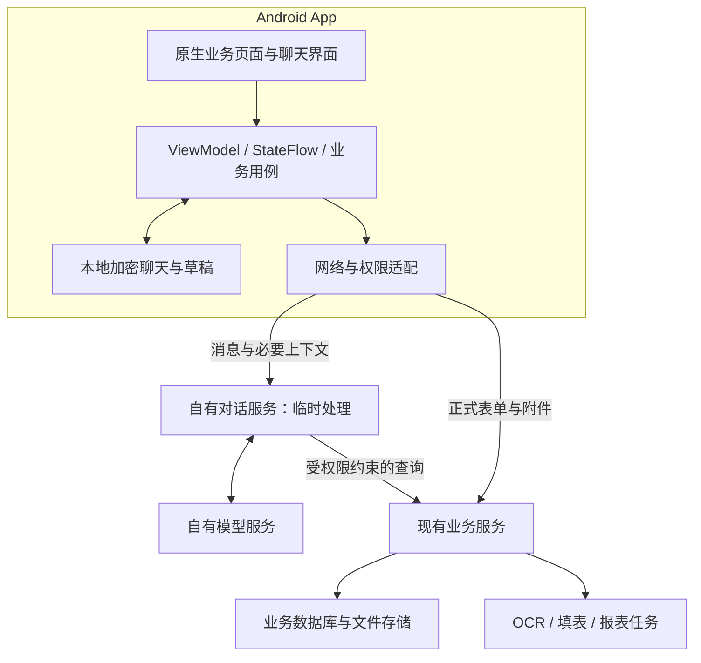

# 移动端需求文档

- 文档版本：v0.2 需求与方案草案
- 更新日期：2026-09-09
- 状态：已纳入本轮完整需求讨论；已确认事项可作为范围依据，技术选型、实现细节和待确认项不等于全部已定稿
- 项目位置：`/home/tdy/projects/mobile/`，独立于 CityBond 项目
- 代码分析基线：CityBond 本地 `origin/develop`，提交 `56437f74`（2026-09-09 10:28）；未拉取远端更新
- 当前阶段：已完成用户后续授权的 B01 环境与基础框架（基础 UI、路由、网络库及模拟器验证）；正式业务与后端改造尚未实现，详见 [开发进度](开发进度.md)

**文档目的与对话来源**

将本轮对话中的产品要求、用户确认、代码分析发现和技术建议汇总为后续页面设计、接口对接、开发及验收的共同依据。按主题整理，保留关键用户原话，不将助手的建议自动记为用户已确认事项。

| 对话节点 | 原始要求或反馈 | 纳入内容 |
| --- | --- | --- |
| 需求发起 | “读取develop分支下的后端代码，给我一个基于Android app的移动端方案，包括架构，技术栈，实现现有的所有功能，并实现用户多轮对话，对话不上传到云端，先不要写代码，有问题向我提问” | Android 平台、develop 基线、全功能、多轮对话、对话隐私、先设计不写代码 |
| 边界澄清 | 对“是否允许对话发送自有后端/内网模型服务器”“是否允许业务表单和附件上传现有后端并使用 OCR”“是否要求离线办理”的回答：“第一第二允许，不要求断网办理业务” | 允许自有服务器处理对话、允许上传业务数据和附件、无需离线正式办理 |
| 深化分析 | “分析业务重难点具体采用那些技术栈去解决这些问题，做到展示所有业务功能” | 业务难点到技术方案的映射、完整入口与字段/操作覆盖、验收矩阵 |
| 文档归档 | “将上面对话添加到移动端的需求文档里” | 更新本文件并关联详细设计与接口清单 |

既有 v0.1 中“此前讨论不可见、整体待补充”的说明已由本轮实际讨论替代。不推测仍未提供的更早历史内容。

**已确认的产品需求**

| 编号 | 需求 | 状态 |
| --- | --- | --- |
| APP-001 | 目标平台为 Android，移动项目独立放在 `/home/tdy/projects/mobile/` | 已确认 |
| APP-002 | 以 develop 分支现有业务为迁移依据，提供架构与技术栈方案 | 已确认 |
| BUS-001 | 实现并展示所有已实现的业务功能，包括复杂页面内部操作和适用的系统管理能力 | 已确认 |
| AI-001 | 提供用户多轮对话，能连续补充、纠正信息并继续办理业务 | 多轮对话已确认，具体交互为下述方案细化 |
| DATA-001 | 对话不上传第三方云端；允许发到自有后端/内网模型服务处理 | 原始要求及后续澄清 |
| DATA-002 | 允许正式业务表单、合同、发票、照片等附件上传现有后端，允许服务器 OCR | 已确认 |
| NET-001 | 不要求断网时正式办理业务 | 已确认 |
| DOC-001 | 当前只分析和整理文档，不编写实现代码；实际缺失信息再向用户提问 | 已确认 |

“功能完整”按各角色授权范围判断，不要求把管理或其他用户数据开放给无权限账号。现有权限、业务规则和操作边界必须保持。

**对话数据与业务数据的边界**

以下是根据澄清形成的当前方案约定，除表中明确写出的用户确认外，属于设计细化，尚未获得逐条独立确认。

| 数据/处理 | 当前方案 |
| --- | --- |
| 对话处理位置 | 自有服务器临时处理，由自有模型推理；用户已明确允许该传输 |
| 聊天正文、历史、摘要 | 手机加密保存；服务器不长期保存，不进入旧聊天消息/请求响应持久化链路 |
| 草稿及续办状态 | 手机保存，服务器使用时重新做权限和业务校验 |
| 正式业务表单与附件 | 用户确认后按现有业务流程保存在后端；用户已明确允许上传 |
| 正式提交回执、幂等记录和审计 | 后端保存完成业务和防重复所需的最小记录，不附带完整聊天上下文 |
| 日志、模型调试及追踪 | 排除聊天正文和摘要；核查网关、模型服务、异常上报及客户端日志 |
| 手机云备份 | 聊天与敏感临时文件排除自动云备份；设备迁移策略另外定义 |
| 断网行为 | 可查看已保存聊天、编辑本地草稿；AI 回复、最新业务查询及正式提交需要联网 |

“不在服务器保存聊天”不等于“不允许服务器保存业务数据”。同一账号换手机不会自动获得本地聊天历史；卸载或丢失加密密钥后不能从服务器恢复历史。是否需要用户主动加密迁移，以及保留期限、退出时清理规则，列为待确认项。

**代码分析结论与限制**

| 发现 | 需求/设计影响 |
| --- | --- |
| 后端基于 FastAPI、SQLAlchemy，使用 PostgreSQL 驱动，具备现有业务服务和后台 Worker | 复用后端接口、计算和事务；手机负责页面、交互与本地状态 |
| 登录采用 Cookie 会话，已有验证码、续期、角色权限与数据范围控制 | Android 需要适配实际登录合同，不能默认已有 JWT/刷新 Token 机制 |
| Assistant 已有多轮对话、候选卡片、草稿、父子续办和表单回执 | 复用业务能力，但调整消息、摘要、工具轨迹及请求响应的存储方式 |
| `/sync/changes` 返回变更对象和缓存失效信息 | 用于更新缓存；不是双向离线同步，也不是实时推送 |
| Web 前端存在计划生成、保证金抵扣和利率反算等 TypeScript 算法 | 迁移需同时核对 Web 行为；缺失的公共计算能力优先补到后端 |
| OCR、填表、整理、导出等任务的持久化及取消/重试能力不同 | 统一展示，但只开放实际支持的任务操作 |
| “成本测算”“AI报告生成（定制）”是占位菜单 | 保留升级中状态；已有综合成本、IRR、组合报表能力仍完整纳入 |

本次是静态代码分析，未启动后端或验证生产环境。静态路由附录提取 45 个文件、508 条 HTTP 路由装饰器声明；不是业务功能数，也不是已验证的运行时接口数。具体挂载路径、输入输出和权限以应用装配、OpenAPI 与联调结果为准。

**建议架构与职责**

建议采用“Android 原生 App + 现有业务后端 + 自有服务器 AI 推理”。主体业务页面使用 Kotlin/Compose，复杂图表和文档预览使用受控嵌入组件。技术栈尚为建议，不代表每项依赖已经选定版本或完成兼容验证。

App 负责功能导航、完整字段展示、输入校验、草稿、聊天上下文及状态恢复。后端负责对象权限、权威财务计算、业务约束、正式写入、事务、回执和审计。AI 负责理解、追问和受约束的工具请求，不能替代后端授权或业务校验。

不要求离线正式办理，因此暂不建设完整的双向离线同步，不在手机部署模型或后端数据库服务。不因 Android 接入而默认更换数据库、拆微服务或引入新的消息队列。

**技术栈建议及用途**

| 层 | 具体技术 | 解决的问题 |
| --- | --- | --- |
| Android 工程 | Kotlin、Gradle Kotlin DSL、版本目录、按业务拆分模块 | 各业务可以独立开发和验收；共用网络、权限、表单、表格和任务组件 |
| 页面与导航 | Jetpack Compose、Material 3、Navigation Compose、自适应单双栏布局 | 手机分组表单、横屏表格、平板主从详情、业务深层跳转 |
| 状态与依赖 | ViewModel、Coroutines、StateFlow、Hilt | 单向状态流、异步取消、搜索防抖、切页恢复、可测试用例 |
| 台账 | LazyColumn、Paging 3、共享横向滚动、服务端分页筛选 | 大量记录、宽表、多条件筛选、列设置、选择及批量操作 |
| 金额与日期 | BigDecimal、受控序列化、LocalDate/Instant | 金额小数精度、元/万元/亿元换算、日期与时区区分 |
| 网络 | Retrofit、OkHttp、CookieJar、流式文件传输 | 复用现有 Cookie 登录、分环境服务地址、请求超时和错误分类 |
| 本地数据 | Room、DataStore、Android Keystore + AES-GCM | 加密聊天和草稿、普通偏好、账号隔离；Room 本身不自动提供数据库加密 |
| 图表 | Compose 指标卡 + 本地打包 Apache ECharts、AndroidX WebKit | 趋势、结构、堆叠、联动与钻取；JS/CSS 不从外部 CDN 加载 |
| 拍照与预览 | CameraX、系统文件选择器、Coil、Compose Canvas、PdfRenderer | 图片、合同多页预览、原文框选、缩放及 OCR 坐标高亮 |
| 报表/表格预览 | 本地 HTML/CSS 渲染器 + WebViewAssetLoader | 合并表头、合并单元格、分页报告；输入为受控结构化数据 |
| 任务 | 前台协程轮询、WorkManager、服务端现有任务 Worker | 实时前台进度与可延迟后台恢复分别处理；进程退出不重复创建服务器任务 |
| 正式业务 | FastAPI、Pydantic、SQLAlchemy、现有数据库与审计 | 对象权限、业务校验、计算、事务、幂等和版本冲突 |
| AI | 自有模型服务、现有 LangChain Agent、明确需要状态编排的 LangGraph | 多轮推理与工具调用；调整对话存储而非重新发明所有业务工具 |
| 文件生成 | 现有 openpyxl、python-docx 等渲染；必要时增加自有 PDF 转换服务 | 保留原格式下载；补齐 App 内预览和打印 |
| 验证 | pytest、JUnit、MockWebServer、Compose UI Test、真机 Macrobenchmark | 财务规则对照、接口变化、权限、复杂页面性能与完整流程验证 |

底层组件的官方资料、选型依据与实现限制详见[业务重难点与全功能展示方案](Android业务重难点与全功能展示方案.md)。具体 Android/Gradle/JDK/依赖版本在建立工程前按兼容矩阵确定。

**业务重难点及解决要求**

| 编号 | 难点 | 具体解决方案与验收关注点 |
| --- | --- | --- |
| DIF-01 | 多融资品种、字段联动、重复明细与机构树 | Compose 分组表单、强类型 Draft、稳定明细 ID、远程树形搜索；类型切换检查受影响字段；AI 与手工操作共用草稿 |
| DIF-02 | 金额、利率、日期、LPR、保证金抵扣、IRR 一致性 | BigDecimal/LocalDate，后端 Decimal 计算服务；逐项核对 Web 算法，补公共计算接口；同输入下预览、保存及导出一致 |
| DIF-03 | 窄屏展示宽台账和所有字段 | 卡片/完整表格/完整详情；LazyColumn、服务端分页、共享横向滚动、冻结列、列设置、保存视图、横屏及关联钻取 |
| DIF-04 | 大数据量、分页与跨页选择 | Paging 3 或页码分页按场景选用；服务端排序筛选、全量合计和导出；不能只对当前页操作并误称全量 |
| DIF-05 | 多轮对话、业务切换及父子续办 | 手机维护上下文、摘要、Draft 和父子任务；每会话串行请求、草稿版本检查；迟到响应不能覆盖新状态 |
| DIF-06 | 对话隐私与任务回执解耦 | Room 内容加密、Keystore；新移动对话入口不写旧聊天表；网关/模型/异常/备份全链路核对，正式回执单独保存 |
| DIF-07 | OCR 原文定位与人工复核 | CameraX、Coil、Compose Canvas、后端页图/证据；缩放后坐标正确，无证据不伪造高亮；修订后进入正式表单校验 |
| DIF-08 | 自动填表、合并表头、字段映射与结果确认 | 原生映射/规则面板 + WebViewAssetLoader 加载受控预览；转义外部内容，不执行文件/模型脚本；公式计算留在服务器 |
| DIF-09 | 长任务、大文件与进程退出 | 流式传输、前台协程轮询、适用的 WorkManager/传输机制、服务端 Worker；保存任务 ID 后恢复查询，按真实能力取消/重试 |
| DIF-10 | 重复提交、超时、双端并发修改 | client_request_id、预期版本、唯一约束、事务和最小回执；参数不一致的重复键拒绝；冲突人工处理，主记录与附件失败分别恢复 |
| DIF-11 | 角色、数据范围与系统管理 | CookieJar、统一权限状态；菜单/按钮/对象/AI/下载同一授权边界；401/403、验证码、停用、真实交互续期均覆盖 |
| DIF-12 | 图表、报表、合计和口径可核对 | Compose 指标卡 + 本地 ECharts，服务器聚合；显示主体、日期、单位、条件和依据；图表可打开数表及明细 |
| DIF-13 | 手机打印与 Office 导出 | 复用 Excel/Word 导出；补齐 PDF 预览及 PrintDocumentAdapter；必要时自有 Office 转换 Worker，验证中文字体、分页和金额 |

特别约束：Room 本身不自动加密；WorkManager 不能保证秒级刷新；已有分片备份上传不代表普通附件已支持断点续传；现有 Assistant 幂等也不代表所有正式业务接口已具备幂等。

**全功能展示与移动端页面范围**

建议底部入口：首页、业务、助手、任务、我的。业务页提供全部功能目录、分组、功能名称搜索和收藏；系统管理在“我的”下，同时可被授权用户通过全部功能目录发现。

每项业务要提供完整详情和适用操作。列表卡片不能代替完整字段，导入导出、状态变更、历史、恢复、预览、关联等不能因移动屏幕小而遗漏。

以下 F01—F40 从代码分析和前轮方案整理，作为覆盖核对分组。权限目录中的文字不自动证明存在可运行接口；实际功能要结合前端行为、业务服务、OpenAPI 和联调逐项验证。

| 编号 | 一级入口 / 功能组 | 完整展示内容与操作 |
| --- | --- | --- |
| F01 | 首页 / 融资总览 | 主体口径、到账、余额、缺口、融资渠道和成本变化、项目进度、每日到账、还款月份钻取；总览配置 |
| F02 | 首页 / 公告与待办 | 公告列表及详情、待办分类与跳转、系统提示、还款日历、单日详情、现金流和项目汇总 |
| F03 | 业务 / 项目台账 | 项目—融资—债务关联展示；列表、筛选、完整详情、创建、修改、导入模板/导入结果、导出、债权方关联、历史 |
| F04 | 项目详情 / 项目进程 | 接洽记录、复核日期/事项等现有操作、再融资关系、阶段调整、融资完成、放弃及恢复、删除及恢复 |
| F05 | 业务 / 融资明细 | 全部、未结清、已结清；主债务、附属债务/费用；创建、修改、删除、历史、合同附件 |
| F06 | 融资明细 / 待补充债务 | 列表与筛选、补充编辑、删除、转正式、转换后的业务跳转 |
| F07 | 债务表单 / 品种与关联 | 普通及品种专用字段、共同债务人、多债权人、自动关联项目、票据、债券、存单/保证金及适用的融资字段 |
| F08 | 债务表单 / 担保措施 | 保证人、不动产抵押、股权质押、应收账款、收费权、存单/保证金、其他担保及无担保；明细增删改 |
| F09 | 债务表单 / 本息与费用 | 还款主体与账号、本金/利息计划生成和转换、导入导出、固定/浮动利率、LPR 重定价、利率反算、保证金抵扣、费用明细 |
| F10 | 融资明细 / 计算与统计 | 任意日期本金余额、未偿余额、放款和资金统计、综合成本、利息和票据预览、IRR 与计算过程/公式导出（依权限） |
| F11 | 业务 / 还款现金流 | 即将到期、按日/月查看、债权方拆分、已付/未付及适用跳过操作、历史处理/重算及关联单据 |
| F12 | 业务 / 资金速记 | 计划/实际列表、增删改、计划转实际、关联债务和预填、保证金/扣款等明细、看板、资金缺口、排行、动态 |
| F13 | 业务 / 财务协同 | 银行账号、联行号解析及账号信息；发票列表/详情/增删改、发票行、关联单位和项目、原有核对与关联操作 |
| F14 | 业务 / 工程协同 | 工程项目创建、修改、状态变更、删除、完整详情与项目关联 |
| F15 | 业务 / 资产协同 | 不动产、实控公司、企业集团；增删改、状态、附件/基础材料、集团口径与项目关联 |
| F16 | 业务 / 还本付息单 | 创建/查询、通知单解析、重复检查、分类计数、自动生成状态/执行、回单核验、办理、打印导出、作废及适用删除 |
| F17 | 业务 / 费用申请单 | 从债务生成、列表/统计、详情、修改、作废、导出 |
| F18 | 业务 / 成本审批单 | 项目选择、默认值、创建/修改、重新生成、版本与历史详情、作废/删除、导出 |
| F19 | 业务 / 对外担保 | 导航、台账增删改、余额/状态调整、OCR 预填、附件、统计/明细统计、已有导入导出路径 |
| F20 | 业务 / 授信统计 | 授信统计、手工授信录入维护、模板与导入、银行/上级机构映射、删除、导出 |
| F21 | 业务 / AI 录入 | 拍照/文件上传、识别与复核、页图高亮、字段/发票行修改、分析历史、源文件、替换、删除、模型调试与性能（依权限） |
| F22 | AI 录入 / 文件与归档 | 模块树创建和维护、文档移动/归类、自动整理、合同摘要和债务候选、合同归档、全自动任务及结果处理 |
| F23 | 业务 / 基础材料 | 实控公司/不动产等预填、基础材料录入任务、关联/解绑、三年一期、候选材料、材料清单分析、文件打包 |
| F24 | 业务 / 自动填表 | 模板上传、工作表预览、字段映射查看/分析/确认、结果预览/确认、重试/重跑、任务历史、下载结果、调试数据（依权限） |
| F25 | 自动填表 / 数据初始化 | 模板下载、导入预览与保存、批次与源文件、记录编辑/清理、单条/批量转入待补充债务、转入任务 |
| F26 | 业务 / 综合查询 | 自然语言、快捷模板、高级筛选；项目情况、融资结构/总量/试算、债务结构/月报、集团口径/概览、借新还旧、担保月末、授信、放款及相关明细 |
| F27 | 综合查询 / 报表 | 组合报表、融资工作报表、现有智能分析任务、结果/条件/说明、预览及 Word/Excel 导出；PDF 打印为补齐项 |
| F28 | 助手 | 本地会话列表、连续聊天、业务追问、候选卡片、草稿修改、跳转表单、父子续办、取消、回执、删除本地历史 |
| F29 | 业务 / 基础资料 | 债务单位树、债权机构、种子配置、担保公司、标准/自定义融资产品、融资品种、不动产等既有资料维护 |
| F30 | 任务 | OCR、整理、材料录入、初始化转入、填表、报表分析、导出、上传/下载；按权限汇入备份恢复状态；只展示各任务支持的操作 |
| F31 | 我的 / 账号 | 登录、验证码、当前用户、改密、会话失效、退出、本地聊天/草稿管理、显示及服务连接设置 |
| F32 | 系统 / 用户与权限 | 用户增改删、启停、密码重置、管理员交接、角色权限查询与允许的配置、权限依赖说明 |
| F33 | 系统 / 参数与公告 | 参数列表和编辑、公告草稿/编辑/发布/撤回/删除；公告与其他系统页的权限分别判断 |
| F34 | 系统 / LPR 与节假日 | 列表、维护、删除、官方导入；节假日发布及现金流刷新结果按现有接口展示 |
| F35 | 系统 / AI 与 OCR 配置 | AI 服务池新增/编辑/删除/测试、状态/统计、OCR 流程与文档类别、提取目录配置及导入 |
| F36 | 系统 / 填表字段和规则 | 字段查询编辑/导入导出、组织关系、规则新增、版本管理、验证、预览、发布、导入导出 |
| F37 | 系统 / 备份恢复 | 列表、计划、存储位置、手工备份/取消/删除/下载、恢复上传/分片、预检、启动/取消、进度、维护状态和允许的维护释放 |
| F38 | 系统 / 审计与开发 | 审计筛选及详情；开发测试数据查看/导入/清理仅在现有环境与权限允许时展示 |
| F39 | 全局 / 表格与历史 | 字段顺序、宽度、显隐、筛选、排序、保存视图、分页偏好、选择/批量操作；对象历史与版本对照按业务支持情况提供 |
| F40 | 全部功能 / 现有占位 | 成本测算、AI 报告生成（定制）显示“升级中”；不与 F10 的已有计算、F27 的已有报表混同 |

所有功能应有可点击的原生入口。现有 Agent 工作流范围包括项目、债务、资金速记、基础资料、银行账号、发票、不动产、实控公司、工程项目、对外担保、还本付息单等已注册操作，以及查询和合同辅助链路。完整页面覆盖不等于所有操作已经支持自然语言执行；未注册的 AI 操作先提供准确导航，新增工具需另行验收。

**多轮对话主流程**

1. 用户进入或新建本地会话，App 恢复本地消息、摘要、当前草稿与待补充信息。
2. 用户发送消息，App 将本轮消息及必要上下文发给自有服务器。
3. 服务器临时构建 Agent 状态，重新校验业务查询权限，返回回复、候选、草稿变化或页面动作。
4. 信息不足时继续追问；对象不唯一时选择候选；缺失基础资料可启动子任务后回到原草稿。
5. App 用同一份草稿展示表单并接受手工修改，提交前执行适用确认。
6. 后端校验正式请求并在事务中完成业务写入、最小回执和审计；App 根据回执结束当前业务，会话继续存在。
7. 网络异常时先判定是否已正式提交，避免重复创建；聊天重新推理与业务重试分开处理。

既有 render_card、open_form、navigate、run_query 语义可作为移动协议参考。需要版本化，未知动作不能随意执行。会话删除、历史编辑、重生成等涉及旧卡片和草稿失效规则，按详细设计实现，不只删除界面文字。

**后端对接与改造范围**

| 项目 | 要求 |
| --- | --- |
| 登录和授权 | 复用 Cookie 会话、验证码、/auth/me 和续期；后台轮询不伪造用户活跃 |
| 无聊天持久化入口 | 调整 Assistant 消息/摘要/请求响应存储、工具状态和正式动作回执的耦合 |
| 财务计算覆盖 | 对照现有后端和 Web，补齐需要共享的计划生成、转换、反算等缺口 |
| 写入可靠性 | 逐接口核对幂等、对象版本及冲突响应，禁止盲目自动重试所有 POST |
| 数据刷新 | 按 /sync/changes 的变更范围失效缓存并重新拉取，处理 has_more、invalidate_all、reset_required |
| 文件与任务 | 复用既有接口；统一 App 展示模型但保留真实能力差异；维护模式暂停写操作 |
| 预览与打印 | 核对结构化表格和 OCR 证据接口，补齐 PDF 预览/下载/打印所需能力 |
| 合同版本 | 建立 OpenAPI、权限目录、字段和卡片协议变化检查，防止客户端静默失配 |

**验收要求**

| 编号 | 维度 | 完成条件 |
| --- | --- | --- |
| AC-01 | 全功能可发现 | F01—F40 每组均有状态；已实现能力在授权范围内可从菜单或对象详情到达，两个占位明确标识 |
| AC-02 | 完整展示与操作 | 完整字段、关联、附件、历史及各自适用增改删、状态、导入导出、预览和恢复操作均有入口 |
| AC-03 | 全业务生命周期 | 创建、编辑、关联、办理、查询、历史和导出按实际状态走通，不能以单个列表可见判定完成 |
| AC-04 | 财务一致性 | Web/App/后端/导出按同一规则一致；月末、闰年、LPR 调整、节假日、部分还本、抵扣和舍入均验证 |
| AC-05 | 多轮对话 | 追问、纠正、候选、父子续办、取消、重启恢复及迟到响应处理正确；表单与聊天共用草稿 |
| AC-06 | 隐私 | 对话原文、摘要和完整上下文不进入服务器持久存储或第三方服务；业务审计仍正常 |
| AC-07 | 权限 | 菜单、对象、按钮、AI 工具、附件和下载不越权；权限变更及账号切换后缓存正确处理 |
| AC-08 | 异常与并发 | 超时、断网、进程退出、重复点击、登录失效、双端编辑及服务恢复不会造成重复正式写入 |
| AC-09 | 文件与任务 | 大文件内存可控，任务结果可追踪；取消、重试和续传只在实际支持时承诺 |
| AC-10 | 展示性能 | 真实规模宽表、长聊天、多页合同、复杂模板在目标设备上达到约定指标；数值待设备和规模确定 |
| AC-11 | 报表打印 | 查询条件、数据口径、金额和导出一致；中文字体、表头、分页及打印取消状态正确 |

每个具体功能进一步记录：编号、来源、页面路由、角色与数据范围、前置条件、字段、读写接口、状态变化、异常、导入导出及验收结果。静态接口清单用于查漏，不替代运行验证。

**建议交付顺序**

1. 明确完整功能和角色映射，设计公共导航、表单、表格、文件与任务组件。
2. 优先验证复杂债务计算、多轮对话不落库、OCR 证据定位、自动填表预览和 App 内打印。
3. 完成项目、融资、速记、现金流、协同、业务单据、担保授信全部业务链路。
4. 完成 OCR、材料、填表、综合查询、报表与系统管理，并进行 F01—F40 全量验收。

以上为实施建议，不是用户已批准的排期。分阶段交付不缩减最终全功能范围；开始实现代码仍需用户后续指令。

**尚待确认的事项**

| 事项 | 当前处理 |
| --- | --- |
| 应用名称、包名、品牌视觉 | 未指定，不自行作为已确认需求 |
| 最低 Android 版本、主要设备及是否专门适配平板 | 架构支持响应式展示，具体兼容范围待确定 |
| Kotlin/Compose 等技术选型与依赖版本 | 本轮建议方案；建工程前核定兼容矩阵 |
| 生产服务地址、模型部署、内网/VPN 访问和证书 | 已确认允许自有服务器处理，具体部署条件待提供 |
| 聊天保留期限、退出时处理、主动导出和换机迁移 | 目前按本地保存、不自动云备份设计，具体策略待明确 |
| 真实台账规模、文件上限、任务并发及性能指标 | 先遵守现有服务限制，验收阈值需真实场景确定 |
| 安装分发、更新方式、实施排期与首批验收优先级 | 未指定；所有已实现业务仍在最终范围内 |

上述细节不阻止继续完善设计，也不意味着用户已同意开发、部署或修改正式业务数据。

**相关文档与变更记录**

- [Android 业务重难点与全功能展示方案](Android业务重难点与全功能展示方案.md)：技术细节、代码证据、官方技术资料与实现约束。
- [develop 后端静态路由清单](develop后端静态路由清单.md)：接口覆盖核对附录，注明静态提取限制。
- v0.1：记录 Android 独立项目与历史信息缺口。
- v0.2：补入本轮用户需求与澄清、数据边界、建议架构/技术栈、13 类业务难点、40 个功能组、多轮流程、后端改造、验收及待确认事项；未实施业务代码。
